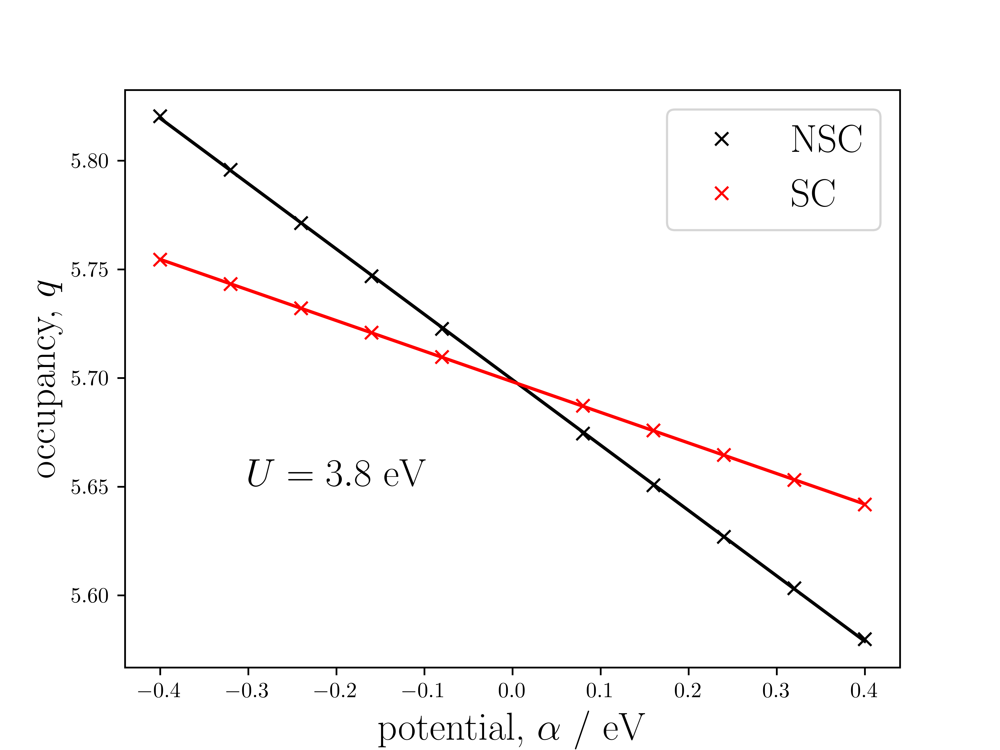

## What value of U should be used?
It is often difficult to answer the question: 'what value of $U$ should we use?'. One may typically systematically increase the value of $U$ until the known band gap of the material is achieved within some level of tolerance. This has two problems: the band gap of the material must be known experimentally, and only gives a lower bound for the true value of $U$. The following describes the method, introduced by Cococcioni and de Gironcoli[^1], that can deduce the value of U for a given ion in a system, exchange-correlation functional and choice of orbital basis.

## Determination of U via a Linear Response method
### Background
As discussed in [DFT+U Overview](overview.md), the $U$ value parameterises the correction to the unphysical curvature of the energy with respect to occupancy given by DFT. One may write down the conjecture that a given $U_{I}$ value, for the atom/$\ell$ $I$, is found through an equation akin to,

$$ U_{I}\sim\frac{\partial^{2}E}{\partial q_{I}^{2}}. $$

The energy that we need to consider is that of a constrained system, whereby we encourage/discourge localisation of electrons for each site in the system,

$$ E_{\text{con}} = \min{\left\{E_{\text{DFT}} + \alpha_{I}\left(n_{I}-q_{I}\right)\right\}}, $$

where $\alpha_{I}$ is a constraint potential parameter, $n_{I}$ is the constraint occupancy and $q_{I}$ is actual occupancy. This leads to,

$$ U_{I}\overset{?}{=}\frac{\partial^{2}E_{\text{con}}}{\partial q_{I}^{2}}. $$

However, this is not quite the true $U_{I}$ value, as there will lie a rehybridisation energy curvature of the s and p electrons that occurs due to the perturbation on the d/f electrons. Thus,

$$ U_{I} = \frac{\partial^{2}E_{\text{con}}}{\partial q_{I}^{2}} - \frac{\partial^{2}E_{\text{hyb}}}{\partial q_{I}^{2}}. $$

### How do we calculate the constrained and rehybridisation energies?
1. We start by finding the energy of the ground state system through a self consistent calculation.
2. $E_{\text{con}}$ is found by a further non-self consistent (NSC) calculation with the constraint potential. The electron density is **not** allowed to vary.
3. $E_{\text{hyb}}$ is found by a further self consistent (SC) calculation with the constraint potential. The electron density is allowed to vary.

Therefore,

$$ U_{I} = \frac{\partial^{2}E_{\text{NSC}}}{\partial q_{I}^{2}} - \frac{\partial^{2}E_{\text{SC}}}{\partial q_{I}^{2}}. $$

### Linear response
In actual calculations, constraining the orbital occupations is not practical to do. Using, 

$$ \frac{\partial E}{\partial q_{I}} = -\alpha_{I}, $$

it is easier to map the above equation with the independent variables as $\alpha_{I}$,

$$ U_{I} = \frac{\partial\alpha_{I}^{\text{SC}}}{\partial q_{I}} - \frac{\partial\alpha_{I}^{\text{NSC}}}{\partial q_{I}}. $$

We can therefore apply a range of $\alpha_{I}$ potentials, and obtain the orbital occupancies, $q_{I}$, non-self consistently and self consistently. The difference in the inverse of the gradients of these linear fittings gives the resultant $U_{I}$.

One would typically expect to obtain linear plottings similar to the following for the Mn d states in MnO:

|  |
| :--: |
| The linear response plots for the occupancy of the d states of Mn in MnO. The two NSC and SC occupancies meet at the origin where $\alpha=0$ as both represent the base ground state occupancies. |

### Multiple atoms of interest
The above formulation is valid provided the $U_{I}$ of interest concerns only one unique set of ions in a given system. If there are symmetrically inequivalent sites for the ion of interest, a matrix method must be implemented where,

$$ U_{I} = \left[\left(\chi^{\text{SC}}\right)^{-1} - \left(\chi^{\text{NSC}}\right)^{-1}\right]_{II}. $$

The $\chi$ matrices are square and have rank the size of the number of unique ions that are of $U_{I}$ interest. Alternatively, one can incoorporate all ions of $U_{I}$ interest into $\chi$ but the columns of a ion equivalent to another that has already been calculated may be determined through symmetry.

The definitions of the $\chi$ matrices are,

$$ \chi_{IJ}^{\text{SC}} = \frac{\partial q_{I}}{\partial\alpha_{J}^{\text{SC}}}, \qquad\qquad \chi_{IJ}^{\text{NSC}} = \frac{\partial q_{I}}{\partial\alpha_{J}^{\text{NSC}}}. $$

## Further considerations
### Supercell convergence
In principle, the $U$ value should be calculated from the variation of a single site in an infinite crystal. In practice, a supercell approach is adopted to approximate this. A systematic approach should be taken, whereby the size of the supercell is increased until the $U$ value obtained changes by a given level of tolerance - perhaps $0.1$ eV for example.

### Charge neutrality
In this spirit of the above discussion, the applied potential should result in charge neutrality across the occupancy perturbations for an infinite crystal. This can be simulated for a finite supercell by imposing,

$$ \sum_{I} \chi_{IJ}^{\text{SC}} = 0, \qquad \sum_{I} \chi_{IJ}^{\text{NSC}} = 0, \quad\forall\;J, $$

and,

$$ \sum_{J} \chi_{IJ}^{\text{SC}} = 0, \qquad \sum_{J} \chi_{IJ}^{\text{NSC}} = 0, \quad\forall\;I. $$

This translates into one additional row and column in each of the $\chi$ matrices where the new elements are computed to satisfy the above equations. The new degrees of freedom simulate a delocalised background charge of the system.

In practice, the $\chi$ matrices gain a null eigenvalue, which makes the inverses required in the $U_{I}$ more difficult to calculate. One must use the Moore-Penrose pseudo-inverse to correctly recover the $U_{I}$ value, of which, requires a singular value decomposition (SVD) method because the rows/columns of the $\chi$ matrices are no longer linearly independent. Despite the inverses of $\chi$ now being ill-defined, the difference between the inverses is. The use of the $\chi$ pseudo-inverse should therefore not introduce any additional numerical error to the calculation, other than the convergence tolerance of the SVD method.

### Determination of U with DFT+U
One may require the application of a $U$ value to recover a reasonable ground state system. The above method is extendable to allow this. The calculated $U$ value will result in a correction to the originally applied $U$ value, and one could reach internal consistency by applying the calculated $U$ values until the computed value vanishes.

[^1]: Physical Review B **71**, 035105 (2005)
